# 🧠 Integrated Brain Connectivity Analysis 🚀

This repository contains the **data preprocessing pipeline** for the thesis project:

**Integrated Brain Connectivity Analysis with fMRI, DTI, and sMRI powered by interpretable Graph Neural Networks.**

The work is based on the methodology described in:

📖 **Qu, G., Zhou, Z., Calhoun, V. D., Zhang, A., & Wang, Y.-P. (2025).**
*Integrated brain connectivity analysis with fMRI, DTI, and sMRI powered by interpretable graph neural networks.*
Medical Image Analysis, 103570.
👉 [DOI link]([https://doi.org/](https://doi.org/10.1016/j.media.2025.103570))

---

## 📚 Project Overview

The goal of this project is to **analyze and understand brain connectivity** by integrating **multi-modal neuroimaging data** (fMRI, DTI, sMRI).

* 🧩 **Data Modalities**:

  * **fMRI** → functional connectivity.
  * **DTI** → structural connectivity (white matter tracts).
  * **sMRI** → structural volumes, cortical thickness.

* 🤖 **Analysis Method**:

  * Interpretable **Graph Neural Networks (GNNs)** for biomarker discovery and prediction.

* 🎯 **Outcome**:

  * Identify biomarkers of brain function.
  * Provide interpretable insights into brain network organization.

---

## 🛠 Current Progress

✅ **Step 1: DICOM → NIfTI Conversion**

* Tools used: `dcm2niix`, MRIcroGL.
* Example:

  ```
  I1092241_Axial_rsfMRI_(EYES_OPEN)_20181213125500_9.nii
  ```

✅ **Step 2: HCP Minimal Preprocessing Pipelines**

* PreFreeSurferPipeline (T1w + T2w preprocessing).
* FreeSurferPipeline (structural reconstruction).
* fMRIVolumePipeline (fMRI preprocessing).

🔜 **Next Steps**

* Feature extraction from processed fMRI, DTI, and sMRI.
* Build connectivity matrices.
* Construct multi-modal brain graphs.
* Train interpretable GNNs.

---

## 🧩 Preprocessing Workflow — Visual Overview




## ⚙️ Installation & Dependencies

Required tools:

* [**FSL**](https://fsl.fmrib.ox.ac.uk/fsl/docs/#/install/index)
* [**FreeSurfer**](https://surfer.nmr.mgh.harvard.edu/fswiki/DownloadAndInstall)
* [**HCP Pipelines**](https://github.com/Washington-University/HCPpipelines)
* [**Connectome Workbench**](https://www.humanconnectome.org/software/connectome-workbench)

---

## 🚀 Usage Example

### 1. Convert DICOM → NIfTI

```bash
dcm2niix -o /mnt/d/brain/NIfTI/I1092241 \
         -f I1092241_Axial_rsfMRI_%p_%s \
         /mnt/d/brain/DICOM/I1092241
```

### 2. Run HCP Pipelines

**PreFreeSurfer**

```bash
/mnt/d/brain/HCPpipelines-master/PreFreeSurfer/PreFreeSurferPipeline.sh \
--path=/mnt/d/brain \
--subject=I1092241 \
--t1=/mnt/d/brain/NIfTI/I1092241/unprocessed/3T/T1w.nii.gz \
--t2=/mnt/d/brain/NIfTI/I1092241/unprocessed/3T/T2w.nii.gz \
...
```

**FreeSurfer**

```bash
/mnt/d/brain/HCPpipelines-master/FreeSurfer/FreeSurferPipeline.sh \
--session=I1092241 \
--session-dir=/mnt/d/brain/I1092241 \
--t1w-image=/mnt/d/brain/I1092241/T1w/T1w_acpc_dc_restore.nii.gz \
--t1w-brain=/mnt/d/brain/I1092241/T1w/T1w_acpc_dc_restore_brain.nii.gz \
--t2w-image=/mnt/d/brain/I1092241/T2w/T2w_acpc_dc_restore.nii.gz
```

**fMRIVolume**

```bash
/mnt/d/brain/HCPpipelines-master/fMRIVolume/GenericfMRIVolumeProcessingPipeline.sh \
--studyfolder="/mnt/d/brain" \
--session="I1092241" \
--fmritcs="/mnt/d/brain/NIfTI/I1092241/I1092241_Axial_rsfMRI_(EYES_OPEN)_20181213125500_9.nii.gz" \
--fmriname="Axial_rsfMRI_Eyes_Open_20181213" \
--fmrires="2" \
--biascorrection="NONE" \
--dcmethod="NONE" \
--gdcoeffs="NONE" \
--processing-mode="LegacyStyleData"
```

---

## 🛠 Troubleshooting

* ❌ `ERROR: unrecognized option: '--subjects-dir'`

  * ✅ Use `--session-dir` instead.

* ❌ `fsl: imcp not found`

  * ✅ Ensure FSL binaries are in your PATH.

* ❌ FreeSurfer license issues

  * ✅ Place `license.txt` in `$FREESURFER_HOME`.

---

## 📖 Reference

If you use this repository, please cite:

**Qu, G., Zhou, Z., Calhoun, V. D., Zhang, A., & Wang, Y.-P. (2025).**
*Integrated brain connectivity analysis with fMRI, DTI, and sMRI powered by interpretable graph neural networks.*
Medical Image Analysis, 103570.

---
